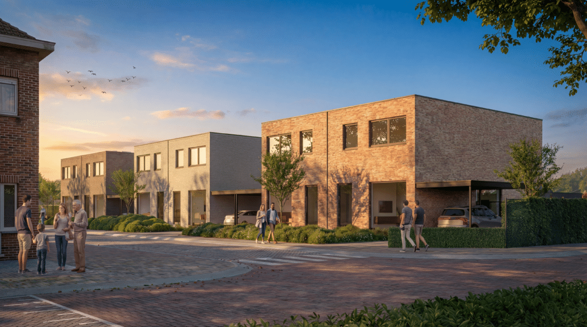
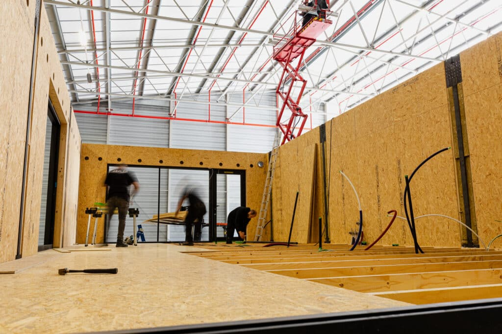
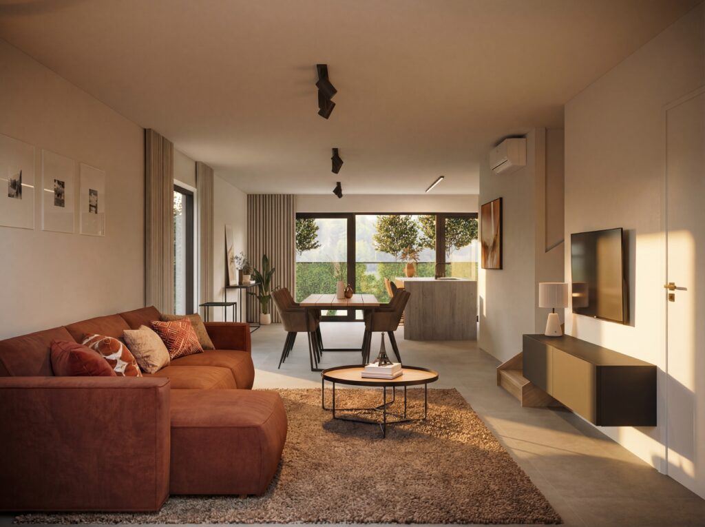
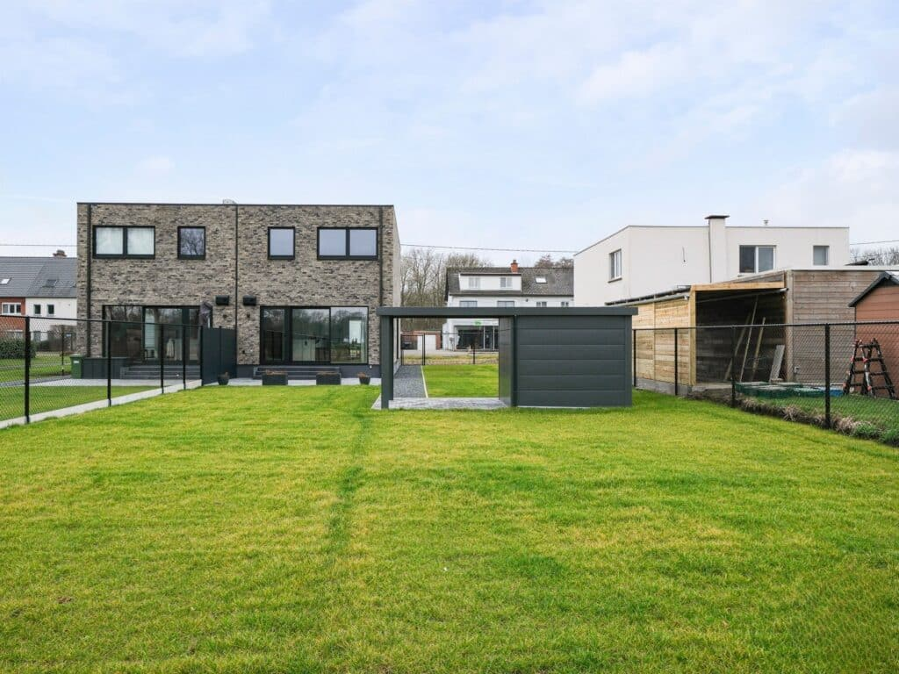

## De KEPLER-woning. Wonen in de toekomst, vandaag al.

**Stel je een thuis voor die zijn tijd lichtjaren vooruit is. Een plek waar comfort, duurzaamheid en zorgeloos wonen naadloos samenkomen. De KEPLER-woning is niet zomaar een huis dat voldoet aan de norm van duurzaamheid – het is een woning die die norm resoluut herdefinieert.**

Met KEPLER introduceren we de meest energiezuinige woning op de Belgische markt. Dankzij een uitzonderlijk E-peil van -18 presteert deze woning ver onder het gemiddelde. Het resultaat? Een ongezien energiecomfort, een gerust gemoed en een besparing op je jaarlijkse energiefactuur tot wel €2.000. Zo wordt duurzaam wonen niet alleen een bewuste keuze, maar ook een slimme investering in jouw toekomst.

Elke KEPLER-woning is tot in de kleinste details afgewerkt. Van hoogwaardige materialen en energiezuinige toestellen tot een volledig aangelegde tuin: alles is voorzien zodat jij je enkel nog hoeft te focussen op wat écht telt – thuiskomen en genieten. Geen keuzestress, geen zorgen. We’ve got you covered.

Dankzij ons vooruitstrevende productieproces, waarbij elke stap van het bouwtraject in eigen beheer wordt uitgevoerd, garanderen we bovendien een ongeëvenaarde prijs-kwaliteitverhouding. Met KEPLER kies je niet alleen voor een woning, maar voor zekerheid, comfort en een duurzame toekomst.

_KEPLER. Meer dan een huis. Een nieuwe standaard in wonen._

## Klaar voor verhuis  
in recordtijd

Een huis kopen is vaak een project van lange adem. Niet bij KEPLER. Bij ons verloopt alles volgens strakke timings en een concreet stappenplan dankzij onze modulaire bouwmethode in eigen atelier. Het resultaat? Kwaliteitsvolle woningen die we aan een hoog tempo bouwen.

##### STAP 1

#### Productie in eigen atelier

Zodra de omgevingsvergunning in orde is, start de productiefase. In ons atelier doen we de voorbereiding en integratie van de prefab-houtskeletstructuur, de energie-installaties en het interieur. En dat allemaal op **7 weken** tijd.

##### STAP 2

#### Voorbereiding van de bouwgrond

Een gespecialiseerd KEPLER-team treft alle voorbereidingen voor de plaatsing. Van grondwerken en funderingswerken tot technische voorbereiding.

##### STAP 3

#### Transport en plaatsing

We vervoeren de KEPLER-woning naar de bouwlocatie met nachttransport. Daarna is het zover: we plaatsen de woning **in slechts 40 minuten**. Tijd voor de afwerking.

##### STAP 4

#### Afwerking

Wij werken **in 10 dagen tijd** de woning tot in de puntjes af. Jij mag op je twee oren slapen, want jij wandelt binnenkort een instapklare woning binnen.

##### STAP 5

#### Oplevering

Zodra je de akte hebt ondertekend, kan je verhuizen. Alles is volledig klaar: van nutsvoorzieningen tot verfwerken en tuinaanleg.

## 6 redenen om te  
kiezen voor KEPLER

##### Energiepositieve en toekomstgerichte nieuwbouwwoningen

De KEPLER-woningen combineren innovatie en energie-efficiëntie op topniveau. Met 18 zonnepanelen, warmtepomp en een krachtige thuisbatterij van 14,2 kWh geniet je van maximale energieopbrengst en slimme opslag. Dit resulteert in een uitzonderlijk E-peil van -18, wat zorgt voor lage energiekosten en een duurzame, toekomstgerichte woning.

##### Volledig hoogwaardig afgewerkte, instapklare all-in woningen

KEPLER staat voor zorgeloos wonen in zijn meest complete vorm. Elke woning wordt tot in de puntjes afgewerkt met kwalitatieve materialen, toestellen en oog voor detail. Dankzij het all-in concept geniet u van een volledig uitgeruste, instapklare woning — inclusief tuinaanleg, laadpaal en schilderwerken — waar comfort, energie-efficiëntie en moderne afwerking samenkomen. Ideaal om meteen te wonen of te investeren zonder zorgen.

##### Value for money door een verticaal geïntegreerd bouwproces

KEPLER combineert slimme ontwikkeling met een efficiënt en verticaal geïntegreerd productie- en bouwproces, waardoor u geniet van maximale kwaliteit tegen een scherpe prijs. Door doordachte keuzes en gestroomlijnde uitvoering wordt elke woning snel, duurzaam en kostenbewust gerealiseerd — een sterke meerwaarde voor zowel bewoners als investeerders.

##### Modern wooncomfort en doordachte indeling

KEPLER-woningen combineren modern wooncomfort met een doordachte indeling. Met 144 m² bewoonbare oppervlakte, vier volwaardige slaapkamers en grote raampartijen geniet u van ruimte, licht en een aangename leefomgeving. Hoogwaardige Miele-toestellen en een slimme indeling zorgen voor extra gebruiksgemak en een hedendaags woongevoel.

##### Een slimme en rendabele investering

Wil je investeren in vastgoed, zonder zorgen over leegstand of onderhoud? Terwijl jij de woning koopt, zorgt KEPLER voor een snelle oplevering, minimale zorgen én maximale verhuurkansen. Het is een investering die loont, die rendeert vanaf dag één en 20 jaar daarna.

##### Betaal bij het verlijden van de akte

Bij KEPLER kies je voor maximale financiële gemoedsrust en transparantie. Wij werken niet onder de Wet Breyne, waardoor je geen voorschot hoeft te betalen tijdens het aankoopproces. Je betaalt pas bij het verlijden van de akte, waardoor je financiële risico tot een minimum beperkt blijft. Zo investeer je met vertrouwen en behoud je volledige controle tot op het moment van de definitieve aankoop.

## Happy voices

Accepteer het gebruik van marketingcookies om deze Google maps te bekijken.

Te koopVerkochtComing soon

## Waar wil jij graag een KEPLER-woning?

**Laat je gegevens achter en we contacteren je  
zodra er een beschikbaar is!**

[Meer weten](https://kepler.be/hou-me-op-de-hoogte/ "Meer weten")