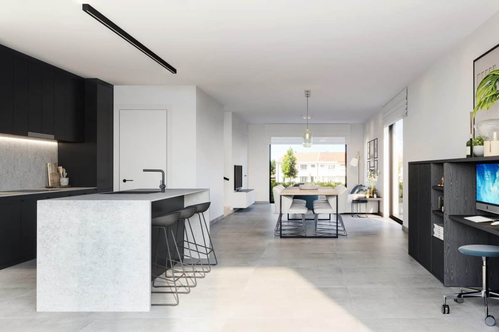
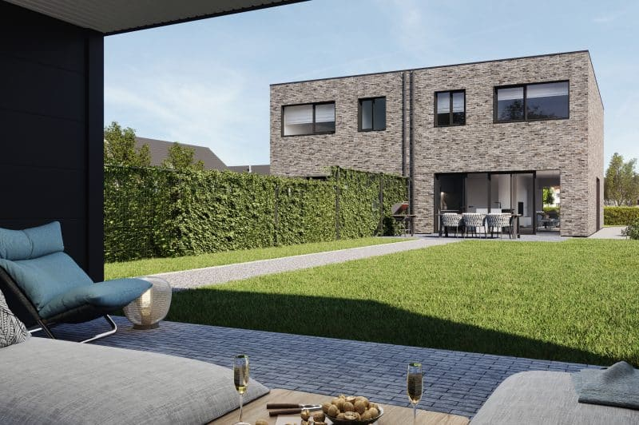
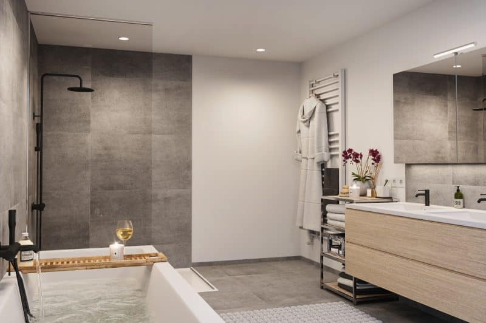
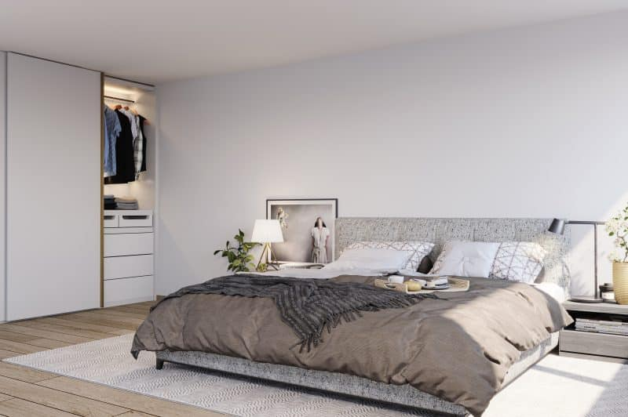

**De naam die wetenschappers geven aan nieuw ontdekte planeten waar leven mogelijk is.**

Een naam die we ook onszelf toe-eigenen. Want, net als die wetenschappers, speuren wij naar een nieuwe horizon om mensen een eigen (t)huis te geven. Een kwalitatieve woning bouwen is vandaag complex en amper betaalbaar. Daarom verlaten wij, als pionier, de platgetreden paden van de bouwsector. Wij lanceren een nieuwe woningnorm op vlak van technologie en energie. Want wij ontwikkelen woningen die lichtjaren voor zijn op hun tijd. Dankzij ons revolutionair productieproces bouwen wij letterlijk en figuurlijk aan de toekomst. Aan de nieuwe thuis van talloze mensen. Een thuis voor vandaag en morgen.

## Ontdek een  
woning die lichtjaren  
vooruit is.

Als innovatieve projectonwikkelaar gaan wij steeds op zoek naar de beste woning. Het hoogste wooncomfort.

Ons vooruitstrevend productieproces laat ons toe woningen op te leveren met een EPC van -15.

Een revolutie op vlak van technologie en ecologie. Een ongezien energiecomfort dat toelaat zorgeloos te wonen.

### Hoogwaardig  
afgewerkt

We werken enkel met de beste materialen en kunnen -door ons unieke productieproces- focussen op de details.

### EPC waarde  
\-15

Onze woningen zijn gebouwd voor de energienorm van de toekomst. Energieneutraal? Wij doen beter.

### En toch  
betaalbaar

Ons unieke bouwproces verlaagt de kosten. Nu én morgen. Jouw Total Cost of Ownership: een scherpe aankoopkost en lage woonkost voor jaren.

### Als eerste op de hoogte zijn van de projecten in jouw buurt?

### Op zoek naar een koper voor jouw grond, projectgebied of afbraakwoning?

### Vacatures

#### [Spontaan solliciteren](https://web.archive.org/web/20230304215841/https://kepler.be/vacature/spontaan-solliciteren/ "Solliciteren - Spontaan solliciteren")

Ingenieur, schrijnwerker of productiemedewerker? Solliciteer spontaan en laat zien waarom jij als persoon én profiel hoort mee te bouwen aan (de toekomst van)...

[Solliciteren](https://web.archive.org/web/20230304215841/https://kepler.be/vacature/spontaan-solliciteren/ "Solliciteren - Spontaan solliciteren")